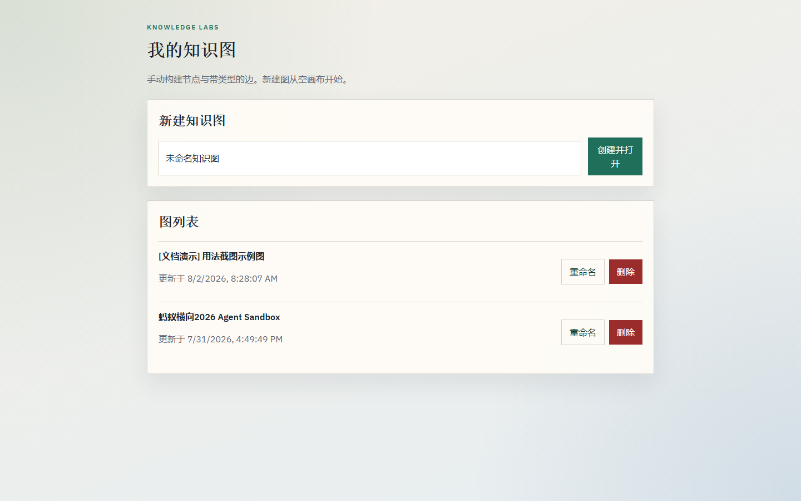
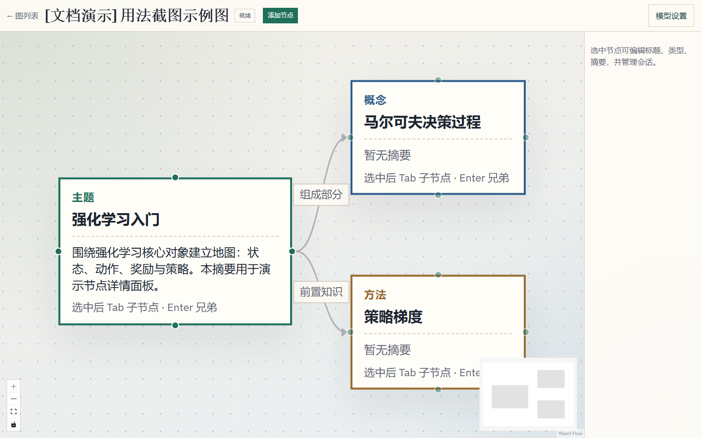
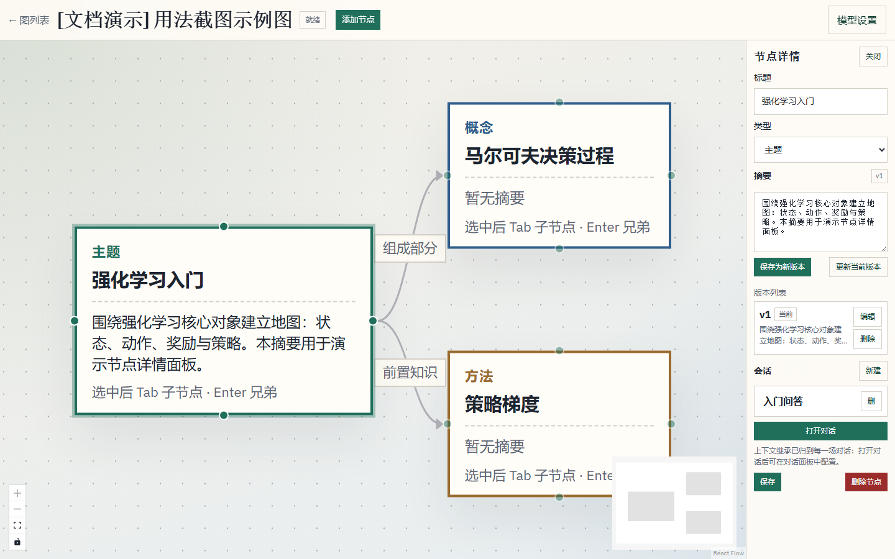
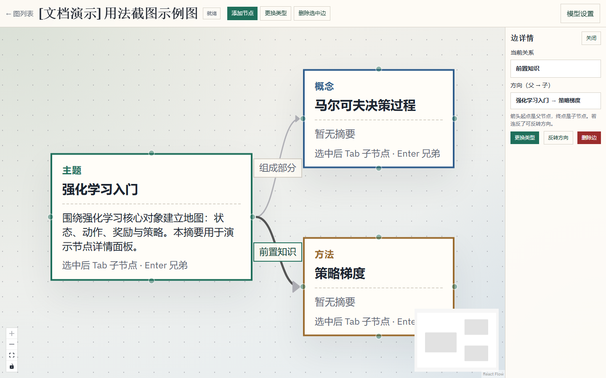
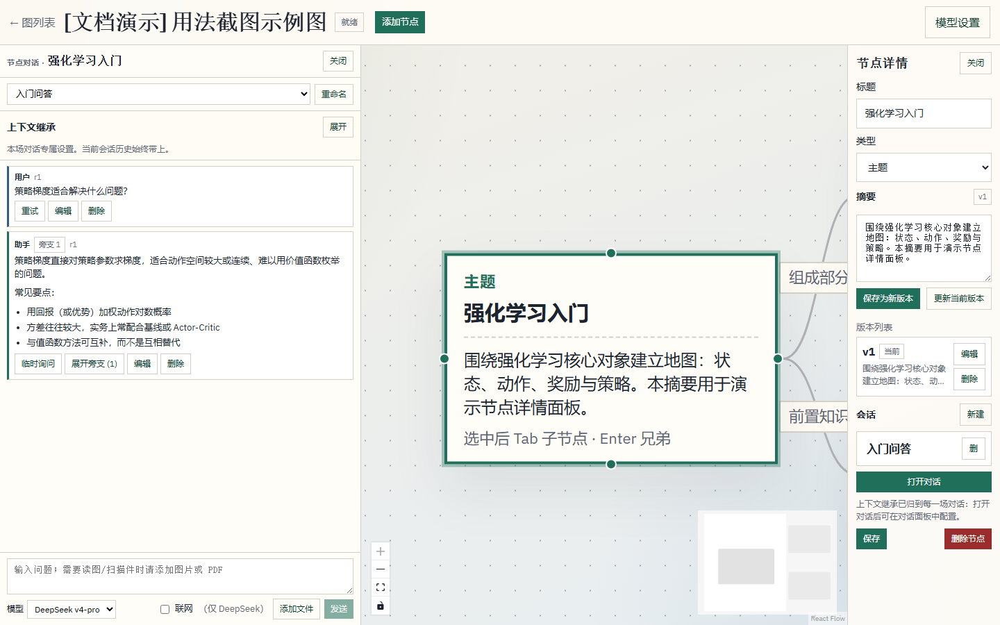
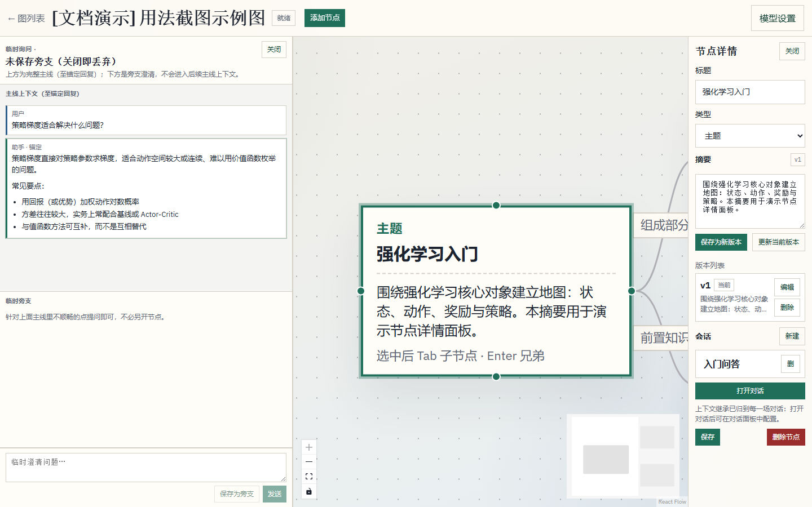

# Knowledge Labs（Learn Knowledge Labs）

个人知识图学习应用：由你**手动**搭建有向、带类型的知识结构，并在节点内与 LLM 对话，把「学什么、怎么连、问什么」都留在自己可控的图上。

> 更细的领域规格见 [`knowledge_graph_mvp_architecture.md`](./knowledge_graph_mvp_architecture.md)。

---

## 许可与商用声明

本仓库代码与文档**目前仅供个人学习、研究与非商业试用**。

- **暂不提供任何商用授权**（包括但不限于：闭源产品嵌入、SaaS 运营、对外收费服务、二次销售、白标交付等）。
- 未经作者另行书面许可，不得将本项目用于商业目的。
- 仓库可见性变为 Public **不代表**开放商用或授予任何商业许可。
- API Key、模型调用费用等由使用者自行承担；作者不对第三方模型服务的可用性、内容与费用负责。

若你需要商用或二次分发授权，请先联系作者单独协商。

---

## 项目简介

### 要解决什么问题

学习复杂主题时，线性笔记很难表达「前置 / 组成 / 对比 / 应用」等关系，而纯聊天又容易丢掉结构。Knowledge Labs 把二者拆开：

1. **图结构由你掌控**——建节点、连边、选边类型、写摘要；
2. **对话默认按节点隔离**——在当前节点里问深、问细；
3. **上下文按会话显式继承**——需要时再从祖先节点或其它会话借入摘要/对话，而不是默认把整张图塞给模型。

系统**不会**自动生成整张知识图，也**不会**替你规划学习路径或把 LLM 的建议自动变成节点。

### 核心概念

| 概念 | 含义 |
|------|------|
| **知识图 (Graph)** | 一张独立的学习地图（标题、描述）。 |
| **节点 (Node)** | 主题/概念/理论/方法/问题/示例/应用等；可写多版本摘要。 |
| **边 (Edge)** | 有向语义关系：是一种、组成部分、前置知识、示例、导致/促进、对比、应用于、自定义等。方向约定为 **父 → 子**（箭头起点为父）。 |
| **会话 (Session)** | 挂在某个节点下的一场对话；同一节点可有多场会话。 |
| **上下文策略** | **按会话配置**：当前会话历史始终带上；可选本节点摘要、同节点其它会话、最多 3 代祖先、非祖先最多 2 个节点；继承粒度可为最近 N 轮 / 选中消息 / 整场会话。 |
| **附件** | PDF（本地抽文本）或图片；有附件时强制走 Kimi，尽量产出详细文字摘要，便于之后换模型续聊。 |
| **可追溯请求** | 每次生成对应 `LLMRequest` + 不可变上下文快照，便于核对「当时到底喂了什么」。 |

### 技术栈

- **后端**：Python · FastAPI · SQLAlchemy 2 · Alembic · SQLite · `uv`
- **前端**：React · TypeScript · Vite · React Flow · Zustand · TanStack Query · `pnpm`
- **模型**：服务端网关 + SSE；DeepSeek（含联网 flash + search）与 Kimi / Moonshot（含读图与附件摘要）

---

## 功能一览

### 知识图编辑

- 图 / 节点 / 边的创建、编辑、软删除；删图级联清理下属数据
- 有边节点不可直接删除（需先处理边）
- React Flow 画布：拖拽落点、边类型中文标签、位置防抖持久化
- 四向连接点；边会按相对位置自动选左右/上下出边，**父子关系由边方向决定，不绑死「左边父、右边子」**
- 选中边可在侧栏 **反转方向**、更换类型、删除
- 快捷键（选中节点且焦点不在输入框/侧栏时）：
  - **Tab**：创建子节点，并默认连「组成部分」边
  - **Enter**：创建兄弟节点（若存在父边，则复制该边类型挂到同一父下）

### 节点内容

- 节点类型与标题编辑
- 摘要多版本：手写确认保存、激活切换、软删、修订（**不会**由模型自动覆盖摘要）

### 节点对话

- 一节点多会话；消息支持编辑（revision）、软删
- 左侧对话面板与右侧节点编辑可同时打开；对话**绑定打开时的节点**，点选其它节点不会自动换对话（避免误以为已切换）
- 流式输出、停止生成；**仅最后一条用户消息**可一键重试（复用原文与附件，软删其后的失败助手回复）
- Markdown 渲染（含 GFM 表格）
- 会话内可配置上下文继承并预览

### 论文问题理解

- PDF 默认先在本地提取原文文本，并直接交给 `deepseek-v4-flash` 作为事实依据；`kimi-k3` 的详细全文解读是可选辅助材料，明确不能覆盖原文
- `deepseek-v4-flash` 先用通俗语言引导“暂定理解”对话；用户通过追问、质疑与复述形成理解后，才将对话沉淀为可编辑的“研究场景、核心问题、主要方法、报告效果”草稿
- 问题地图继承该阶段的已确认理解与完整对话，继续围绕“具体有哪些问题、成因与边界”推敲；用户决定沉淀时才生成可编辑问题卡，并补充自己为什么关心、具体卡在哪里
- 为选中的问题生成“最小解释图候选”：必懂、按需展开、延伸三类知识；只有用户明确操作才会关联或新建知识图节点
- 回到原文锚点，由用户填写解释并标记“能解释 / 部分理解 / 仍卡住”。完成的是一个问题理解切片，不是整篇论文阅读或学习路线的完成
- 该流程默认不携带知识图旧对话、不联网搜索，也不会自动判定用户已经理解

### 模型路由（服务端）

| 场景 | 行为 |
|------|------|
| 纯文字 | 可选 `deepseek-v4-flash` 或 `kimi-k3` |
| 勾选联网 | 仅 DeepSeek：`deepseek-v4-flash` + thinking + 官方 `web_search` |
| 带图片/PDF | 强制 `kimi-k3` 做尽可能详细的文字摘要；建议本轮指令写短 |
| 跨厂商续聊 | 历史默认只带最终正文；同厂商可保留更多 vendor 细节 |

API Key **只存在后端环境变量**，不会下发给浏览器。

### 持久化

默认写入本机：

- 数据库：`backend/data/knowledge_labs.db`
- 附件：`backend/data/uploads/`

关闭前后端再启动，图、对话、策略与附件仍在（勿删 `backend/data/`）。该目录已在 `.gitignore` 中忽略。

---

## 使用说明

### 环境要求

- Python 3.12+（见 `backend/.python-version`）与 [uv](https://github.com/astral-sh/uv)
- Node.js 20+ 与 [pnpm](https://pnpm.io/)
- （可选）DeepSeek API Key、Moonshot / Kimi API Key——按你要用的能力配置

### 1. 启动后端

```bash
cd backend
uv sync
cp .env.example .env
# 编辑 .env，至少配置你打算使用的 Key，例如：
#   DEEPSEEK_API_KEY=...
#   MOONSHOT_API_KEY=...   # 或 KIMI_API_KEY
uv run alembic upgrade head
uv run uvicorn app.main:app --reload --port 8000
```

- 健康检查：http://127.0.0.1:8000/api/v1/health  
- OpenAPI：http://127.0.0.1:8000/docs  

常用环境变量见 `backend/.env.example`（也兼容 `DEEPSEEK_API` / `KIMI_API_KEY`）。可选覆盖：`DATABASE_URL`、`UPLOAD_DIR` 等（见 `backend/app/config.py`）。

### 2. 启动前端

另开终端：

```bash
cd frontend
pnpm install
pnpm dev
```

浏览器打开 http://127.0.0.1:5173（开发代理会把 `/api` 转到 `8000`）。

### 3. 推荐操作流程（配图）

下列截图来自专用演示图 `[文档演示] 用法截图示例图`（脚本自动创建，**不会改你已有的其它图**）。原图在 [`docs/images/usage/`](./docs/images/usage/)。

#### 3.1 图列表：新建 / 打开

在「我的知识图」输入标题 → **创建并打开**。列表里可重命名或删除（软删）。



#### 3.2 画布：节点与边

顶栏 **添加节点**；选中节点后 **Tab** 建子节点、**Enter** 建兄弟。从父节点拖到子节点连边并选类型。父子关系看箭头方向（父 → 子），不绑死左右摆放。



#### 3.3 节点详情：摘要与会话

选中节点后，右侧可改标题/类型、写摘要版本，并管理该节点下的多场会话。



#### 3.4 边详情：换类型 / 反转方向

选中边上的标签，可更换关系类型；连反了点 **反转方向**。



#### 3.5 节点对话

在会话区点 **打开对话**：左侧为绑定该节点的对话（与右侧编辑可并存）。可选模型、联网、附件；助手气泡上可 **临时询问**。



#### 3.6 临时询问（旁支）

针对某条助手回复开旁支澄清：上方是完整主线（至锚定回复），下方是旁支。默认关闭即丢弃；**保存为旁支** 后挂在该气泡下，不进入后续主线上下文。



已保存的旁支可在气泡上 **展开旁支** 再打开续聊：


#### 重新生成截图

前后端本地跑起来后：

```bash
cd backend
uv run --with playwright --with httpx python ../scripts/capture_usage_screenshots.py
```

### 4. 运行测试

```bash
cd backend
uv run pytest
```

---

## 仓库结构（简要）

```text
backend/          FastAPI 应用、迁移、测试
frontend/         Vite React 客户端
knowledge_graph_mvp_architecture.md   领域与实现规格
```

后端按 `api` / `services` / `models` / `repositories` / `schemas` 分层；前端按 `pages`、`features/*`、`entities/*` 组织。

---

## 明确不做 / 已知局限

- 不自动生成整张知识图，不自动改边/建点  
- 不做全局知识库 RAG、多人协作、间隔复习或掌握度判定  
- 摘要不会由模型自动写入（需你确认保存）  
- 流式「取消」依赖单进程内存标志，不适合多 worker 水平扩展（MVP）  
- 附件目前支持常见图片与 PDF；超大文件受 `MAX_UPLOAD_BYTES` 限制  

旧版 README 中「无多模态」已过时：当前支持 Kimi 读图与 PDF 文本抽取后的摘要流程。

---

## 贡献与反馈

欢迎提 Issue 讨论产品与实现。在商用授权明确之前，请勿将本仓库用于商业产品交付。较大改动建议先开 Issue 对齐设计意图（尤其是上下文继承与模型路由规则）。
